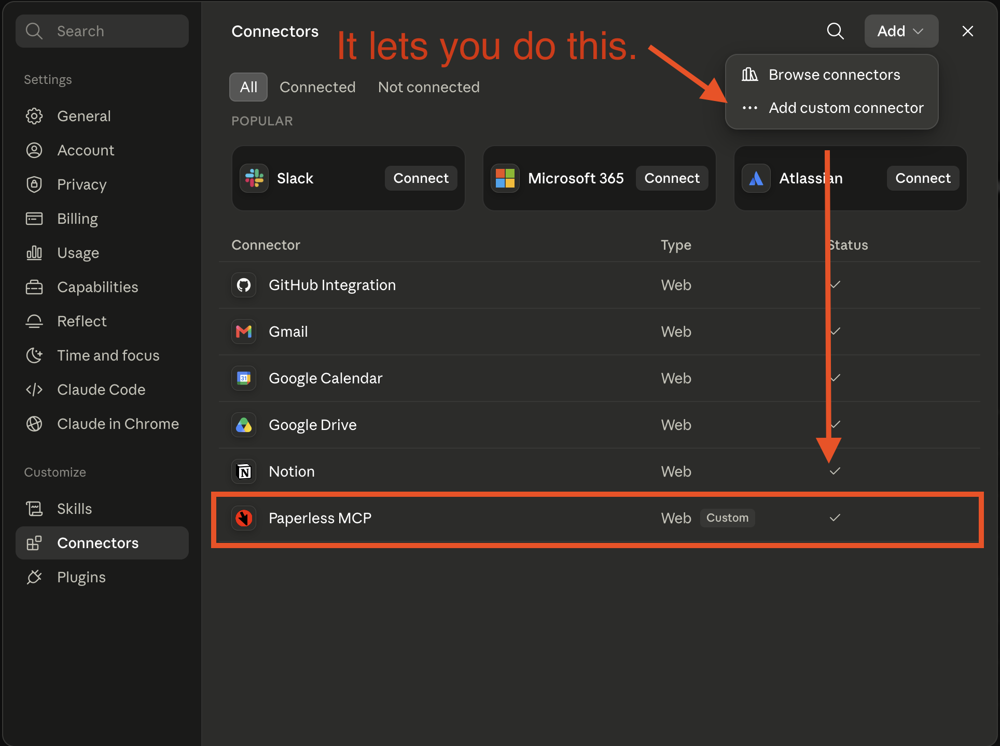

# paperless-mcp (Cloudflare Workers)

> [!IMPORTANT]
> This is 100% vibecode, but it works!
> The deploy guide at [./DEPLOY.md](./DEPLOY.md) is reliable as of July 2026



A remote [MCP](https://modelcontextprotocol.io) server for [paperless-ngx](https://docs.paperless-ngx.com/),
deployed on [Cloudflare Workers](https://developers.cloudflare.com/workers/) so it can be registered
behind a [Cloudflare MCP server portal](https://developers.cloudflare.com/cloudflare-one/access-controls/ai-controls/mcp-portals/)
and used from claude.ai (web) and other hosted MCP clients — no local process required.

Ported from [`nloui/paperless-mcp`](https://github.com/nloui/paperless-mcp) (stdio/Express) to
Cloudflare's `McpAgent` + Streamable HTTP stack (Web-standard APIs only — no Express).

## Tools (16, exact parity with the reference)

| Area | Tools |
| --- | --- |
| Documents | `search_documents`, `get_document`, `download_document`, `post_document`, `bulk_edit_documents` |
| Tags | `list_tags`, `create_tag`, `update_tag`, `delete_tag`, `bulk_edit_tags` |
| Correspondents | `list_correspondents`, `create_correspondent`, `bulk_edit_correspondents` |
| Document types | `list_document_types`, `create_document_type`, `bulk_edit_document_types` |

## Architecture

```
claude.ai / web agent  ──OAuth (Cloudflare Access, your IdP)──▶  MCP Server Portal
                                                                      │
                                          Streamable HTTP + static header (admin credential)
                                                                      ▼
                              paperless-mcp Worker  (McpAgent.serve("/mcp"))
                                                                      │
                                       Token auth (Authorization: Token <API_KEY>)
                                                                      ▼
                                          your paperless-ngx instance /api
```

This deployment is **single-tenant**: one Worker talks to one paperless-ngx instance, using
credentials stored as Worker secrets. The Worker itself is protected by a single static bearer
token (`MCP_AUTH_TOKEN`) checked on every request — the portal (or any other client) must send
`Authorization: Bearer <MCP_AUTH_TOKEN>`.

## 1. Prerequisites

- A paperless-ngx instance reachable over **public HTTPS** (a direct hostname, or a
  [Cloudflare Tunnel](https://developers.cloudflare.com/cloudflare-one/networks/connectors/cloudflare-tunnel/)).
  Workers run on Cloudflare's edge and cannot reach a LAN-only instance directly.
- A paperless-ngx **API token**: log in → user icon → *My Profile* → generate/copy the API token.
- Node.js + npm, and a Cloudflare account.

## 2. Install and deploy

Follow the [DEPLOY.md](./DEPLOY.md) instructions.

## 4. Local development

```sh
cp .dev.vars.example .dev.vars   # fill in real values (gitignored)
npm run dev                       # wrangler dev on http://localhost:8787
npm run type-check                # tsc --noEmit
```

Test with [MCP Inspector](https://github.com/modelcontextprotocol/inspector):

```sh
npx @modelcontextprotocol/inspector
# Transport: Streamable HTTP
# URL: http://localhost:8787/mcp
# Header: Authorization: Bearer <MCP_AUTH_TOKEN>
```

A request with a missing or wrong `Authorization` header returns `401 Unauthorized`; the tools
list should show all 16 tools with the correct token.

## Notes

- `nodejs_compat` is enabled (see `wrangler.jsonc`) so `Buffer` works for the base64 handling in
  `post_document` / `download_document`.
- Large uploads/downloads are bounded by [Workers request/response limits](https://developers.cloudflare.com/workers/platform/limits/) —
  fine for typical PDFs, but very large archives may need a different approach.
- `search_documents` strips the OCR `content` field and thumbnail/download URLs from results (as
  in the reference implementation) to avoid blowing up token usage; use `get_document` for full
  detail on a specific document.
